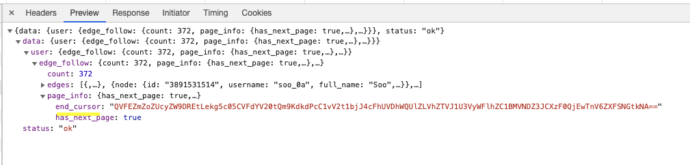

# 인스타그램 API를 활용한 크롤링


## 준비과정 및 연구 

1. 크롬개발자모드 네트워크탭 preserve log 체크
2. m.instagram.com/사용자id -> 팔로우 탭을 누름

네트워크탭에서 요청을 확인해보자. json으로 response를 받는데. 요청은 인코딩 되어있으므로 https://meyerweb.com/eric/tools/dencoder/ 여기서 url 디코딩을 할 수 있다.


1. 첫번째 요청 (팔로우 클릭시 발생하는 요청)
```
URL : https://www.instagram.com/graphql/query/?query_hash=d04b0a864b4b54837c0d870b0e77e076&variables=%7B%22id%22%3A%22486054166%22%2C%22include_reel%22%3Atrue%2C%22fetch_mutual%22%3Afalse%2C%22first%22%3A24%7D
```
```
URL decode : https://www.instagram.com/graphql/query/?query_hash=d04b0a864b4b54837c0d870b0e77e076&variables={"id":"486054166","include_reel":true,"fetch_mutual":false,"first":24}
```

2. 두번째 요청 (팔로우 탭에서 스크롤을 내려야함)
```
URL : https://www.instagram.com/graphql/query/?query_hash=d04b0a864b4b54837c0d870b0e77e076&variables=%7B%22id%22%3A%22486054166%22%2C%22include_reel%22%3Atrue%2C%22fetch_mutual%22%3Afalse%2C%22first%22%3A12%2C%22after%22%3A%22QVFEZmZoZUcyZW9DREtLekg5c05CVFdYV20tQm9KdkdPcC1vV2t1bjJ4cFhUVDhWQUlZLVhZTVJ1U3VyWFlhZC1BMVNDZ3JCXzF0QjEwTnV6ZXFSNGtkNA%3D%3D%22%7D
```
```
URL decode : https://www.instagram.com/graphql/query/?query_hash=d04b0a864b4b54837c0d870b0e77e076&variables={"id":"486054166","include_reel":true,"fetch_mutual":false,"first":12,"after":"QVFEZmZoZUcyZW9DREtLekg5c05CVFdYV20tQm9KdkdPcC1vV2t1bjJ4cFhUVDhWQUlZLVhZTVJ1U3VyWFlhZC1BMVNDZ3JCXzF0QjEwTnV6ZXFSNGtkNA=="}
```

확인이 필요한건 총 3가지가 있음. 첫번재로는 "query_hash", 두번째로는 "after", 세번째로는 "first"임.

첫번째로 query_hash를 만들어내야하는데 아래 링크를 참고해서 연구가 더 필요하다. 네트워크탭에서 자바스크립트 하드코딩된거를 활용하는것 같은데,,,,흠.. https://github.com/mineur/instagram-parser/issues/7

두번째로는 after를 확인해보자 두개의 디코딩된 url을 비교해보면 첫번째 요청에는 없지만 두번째 요청에서 "after"가 생긴걸 볼 수 있음. after는 첫번째 요청에서 받아온 json 파일을 연구해본 결과 end_cursor와 같은걸 확인할 수 있었음.



세번째로는 first인데 first가 의미하는걸 도대체 모르겠음. 여러 요청을 비교해보았는데 어떠한 공통점이 있는지 아직은 못찾았음..


> to be continued...
